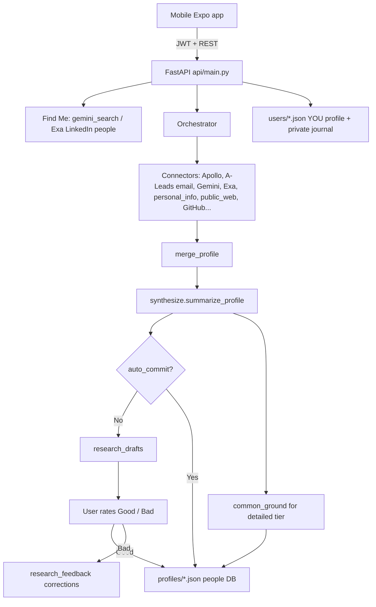

# Connect Deeply

Pre-meeting research that finds **real common ground** — not generic icebreakers.  
You pick *who* you’re meeting (by name + LinkedIn), we research their public footprint, and the app surfaces talk topics, openers, and a dossier you can trust.

---

## Problem we solve

Meeting someone new (conference, intro, sales call, alumni coffee) usually means:

1. **Slow, shallow Google / LinkedIn tabs** that don’t stick together into a briefing  
2. **Same-name confusion** — facts from the wrong “Alex Chen”  
3. **Generic openers** (“How’s the weather?”) instead of shared interests or career overlap  
4. **No memory** of what you learned last time, or what was *wrong* so research can improve  

Connect Deeply turns “I’ve got 5 minutes before we meet” into an identity-locked briefing plus conversation ideas grounded in **you ∩ them**.

---

## Who it’s for (target customers)

| Persona | Why they care |
|--------|----------------|
| **Founders & operators** | Warm intros and investor / customer meetings |
| **Sales / BD / recruiters** | Specific, respectful outreach before the call |
| **Conference & community networkers** | Remember people and open with something real |
| **Students & alumni** | Coffee chats, mentor asks, recruiting without cringe |
| **Anyone who hates small talk** | Prefer shared hobbies, cities, work history, writing |

---

## What the product does

1. **Find Me / candidates** — name → exact matches first (Exa LinkedIn people search + Gemini fallback); if none, probable people with a clear “exact match not found” message. Photos when Enrich Layer / Apollo can fill them  
2. **Pick a person** — the LinkedIn URL you select becomes the **canonical identity** for the whole run  
3. **Deep research** — connectors fan out (Apollo, A-Leads contact email, Gemini Search, Exa, personal milestones, public web, GitHub, …)  
4. **Synthesize** — Gemini turns sources into a structured briefing with cited sources  
5. **Common ground** (detailed tier) — talk topics / openers from *your* profile vs *theirs* (overlap kept internal; UI shows conversation ideas)  
6. **Ask about them** — chat on the person screen, grounded only in the dossier + conversation ideas  
7. **Good / bad rating** — draft first; **Good** saves to people DB; **Bad** discards and stores corrections for the next run  
8. **You at signup** — research *yourself* the same way, then rate and own your public dossier + private journal  

Instagram (when `fetch_social`) collects multiple Google candidates and ranks them with **face matching** against the LinkedIn photo when available.

Token costs (API): **basic = 1**, **detailed = 3**. New accounts start with `STARTING_TOKENS` (default **15**).

---

## Requirements

### Software

- **Python 3.9+** (backend)
- **Node 20+** (Expo mobile)
- **macOS / Linux** for local API; phone or simulator for the app

### API keys (see `backend/.env.example`)

| Key | Required? | Used for |
|-----|-----------|----------|
| `GEMINI_API_KEY` | **Yes** | Search angles, synthesis, common ground |
| `EXA_API_KEY` | Strongly recommended | Find Me LinkedIn people + deep search |
| `APOLLO_API_KEY` | Optional | Licensed enrich + Find Me photos |
| `ALEADS_API_KEY` | Optional | Post-pick work email (A-Leads); optional phone via `ALEADS_FIND_PHONE` |
| `ENRICHLAYER_API_KEY` | Optional | LinkedIn photo / profile by URL |
| `GITHUB_TOKEN` | Optional | Better GitHub rate limits |
| `SUPABASE_*` | Optional | Dual-write / hosted DB |
| `API_JWT_SECRET` | **Yes** for API auth | JWT signing |
| Social scrapers (`SCRAPECREATORS`, etc.) | Optional | Opt-in Instagram / Facebook / Twitter |

Copy env:

```bash
cp backend/.env.example backend/.env
# fill GEMINI_API_KEY, EXA_API_KEY, API_JWT_SECRET at minimum
```

---

## How to run

### 1. Backend API

```bash
cd backend
python3 -m pip install -r requirements.txt
python3 -m uvicorn api.main:app --reload --host 0.0.0.0 --port 8000
```

Must run from `backend/` (so `api.main:app` resolves).  
`--host 0.0.0.0` is required for a **physical phone** on the same Wi‑Fi.

Health check: [http://127.0.0.1:8000/health](http://127.0.0.1:8000/health)

### 2. Mobile (Expo)

```bash
cd mobile
npm install
# Physical device: set your Mac LAN IP (must match uvicorn host)
# echo 'EXPO_PUBLIC_API_URL=http://YOUR_LAN_IP:8000' > .env
# or set DEV_API_URL briefly in mobile/lib/api.ts, then clear before commit
npx expo start -c
```

Open with Expo Go (iOS/Android) or a simulator. After changing `.env`, restart Expo with `-c`.

Find Mac LAN IP: `ipconfig getifaddr en0`

### 3. CLI (optional)

```bash
cd backend
python3 cli.py --name "Someone" --tier detailed
```

---

## Product / data flow



---

## Repo map (high level)

```
Connect_Deeply/
├── README.md                 ← you are here
├── docs/FILE_MAP.md          ← every source file explained
├── backend/                  ← research engine + FastAPI
│   ├── api/                  ← HTTP routes, auth, users
│   ├── connectors/           ← Apollo, Exa, Gemini, socials, …
│   ├── sql/                  ← optional Supabase schemas
│   ├── profiles/             ← researched people (+ _drafts, _feedback)
│   ├── users/                ← accounts (gitignored data)
│   ├── cli.py                ← terminal research
│   ├── orchestrator.py       ← fan-out to connectors
│   ├── synthesize.py         ← briefing JSON from Gemini
│   ├── common_ground.py      ← conversation ideas
│   ├── identity_lock.py      ← canonical LinkedIn helpers
│   ├── research_drafts.py    ← pending Good/Bad drafts
│   └── research_feedback.py  ← ratings + corrections
└── mobile/                   ← Expo React Native app
    ├── app/                  ← screens (auth, home, person, profile, CRM)
    ├── components/           ← UI, signup sheet
    └── lib/                  ← api client, auth, theme
```

For a **per-file** description, see **[`docs/FILE_MAP.md`](docs/FILE_MAP.md)**.

---

## Key API routes

| Method | Path | Purpose |
|--------|------|---------|
| POST | `/auth/signup` | Create account (+ optional self-research) |
| POST | `/auth/login` | Login |
| GET/PATCH | `/me`, `/me/profile` | Current user |
| POST | `/me/research` | Re-research yourself (draft until rated) |
| POST | `/candidates` / `/public/candidates` | Find Me disambiguation |
| POST | `/research` | Research a person (+ optional common ground) |
| GET | `/research/drafts/{id}` | Load draft briefing |
| POST | `/research/feedback` | Good (commit) / Bad (discard + notes) |
| GET | `/people`, `/people/{name}` | CRM + dossier |

---

## Storage (MVP)

| Path | Contents |
|------|----------|
| `backend/users/<id>.json` | Account, tokens, YOU profile |
| `backend/users/_index.json` | email → user id |
| `backend/profiles/*.json` | Researched people |
| `backend/profiles/_drafts/` | Ephemeral drafts awaiting rating |
| `backend/profiles/_feedback/` | Local good/bad feedback index |
| `backend/interactions/*.jsonl` | CRM events |

Secrets (`.env`) and runtime data under `users/` / `profiles/` are gitignored. Optional Supabase dual-write via `backend/sql/*.sql`.

---

## License / status

MVP in active development. Mobile + API + CLI paths all share the same research core.
